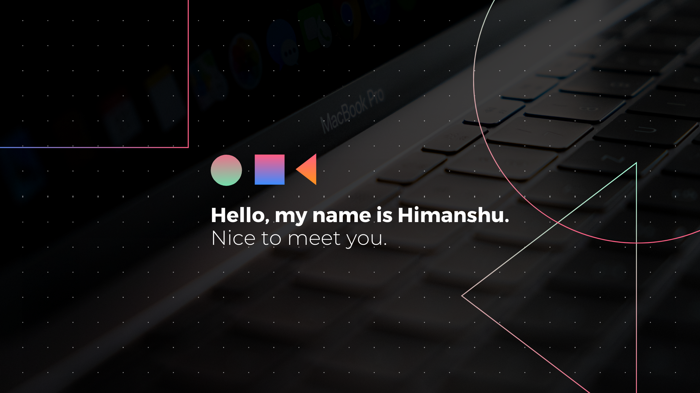

<h4 align="center">I'm a computer engineering student 💻 from India who loves to code.</h4>

  
  
  
  
  
  

----

An avid and passionate coder specializing in different languages. I love to build and design websites which the end user would enjoy using while keeping the website performant and the code clean. Up for freelance web development work and collaborating on exciting <b>Open Source & Personal</b> projects.

## ⚡ Stuff I Know

----
## 🤔 Stuff To Explore

 

  

> Happily turning coffee into code!✅
